<!--
# TODO

- [ ] "Important Files" sections?

-->

# Blockchain Testnet  <!-- omit in toc -->

<br>
*Image Credit (Above): [LuckyStep48](https://www.shutterstock.com/g/LuckyStep48)*

---

## 1. Quick Start

### 1.1. Start the Blockchain Network

```bash
# Clone this repository and navigate to it on your local machine
$ git clone https://github.com/nfroemm/blockchain-testnet
$ cd blockchain-testnet

# Start the blockchain network
$ bash ./run_node.sh 0  # launch `node0` -- do this first!
$ bash ./run_node.sh 1  # launch `node1` -- in a different terminal window
$ bash ./run_node.sh 2  # launch `node2` -- in a different terminal window
$ bash ./run_node.sh 3  # launch `node3` -- in a different terminal window
```

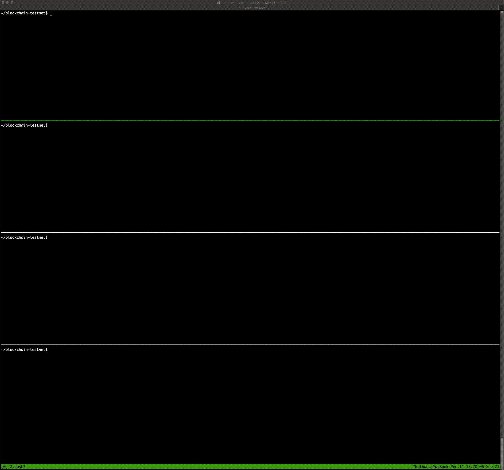
<br>
<br>

### 1.2. Send Transactions on the Blockchain Network

After the blockchain network has been started (see above), transactions may be sent between any nodes in the network.  The GIF below shows an example transaction of `node2` sending `1234 ETH` to `node1` using the [MyCrypto Ethereum wallet manager](https://www.mycrypto.com/).  The screenshots below show how to properly setup MyCrypto for this network.  See below for more details.

#### 1.2.1. MyCrypto GIF and Screenshots

<br>
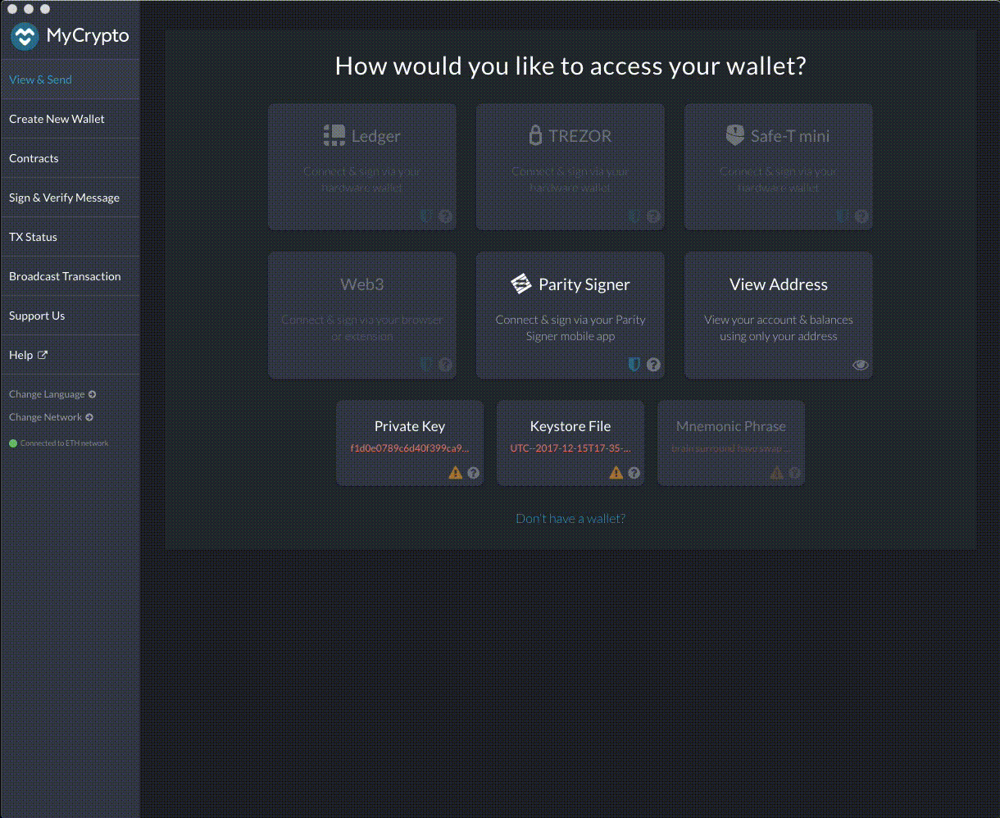
<br>
<br>
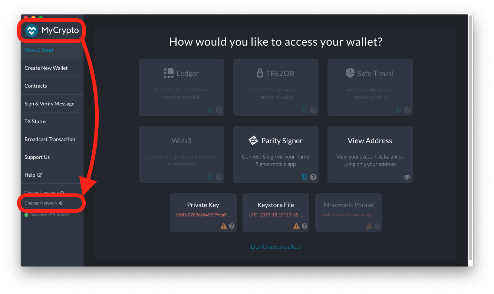
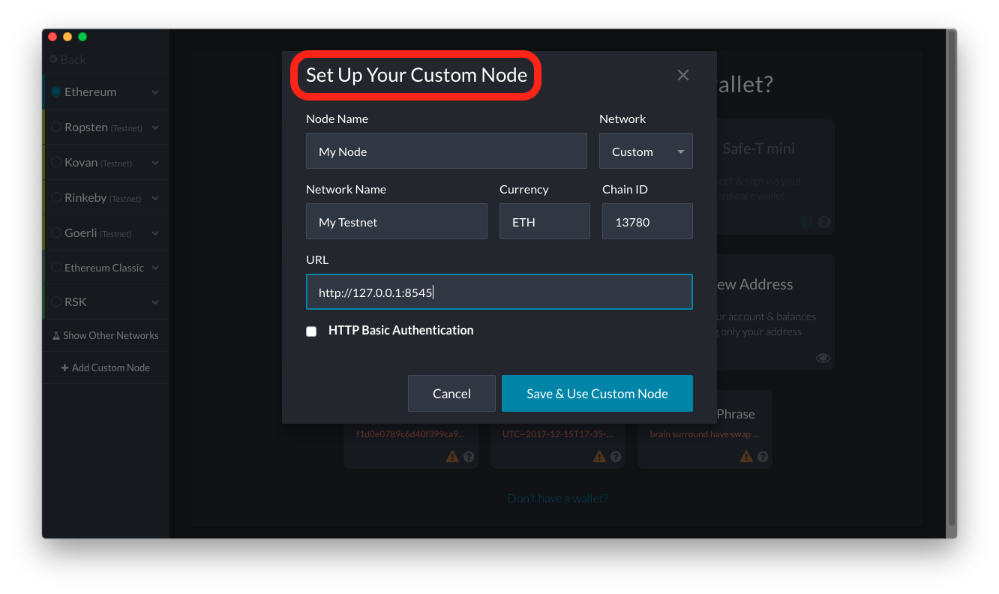
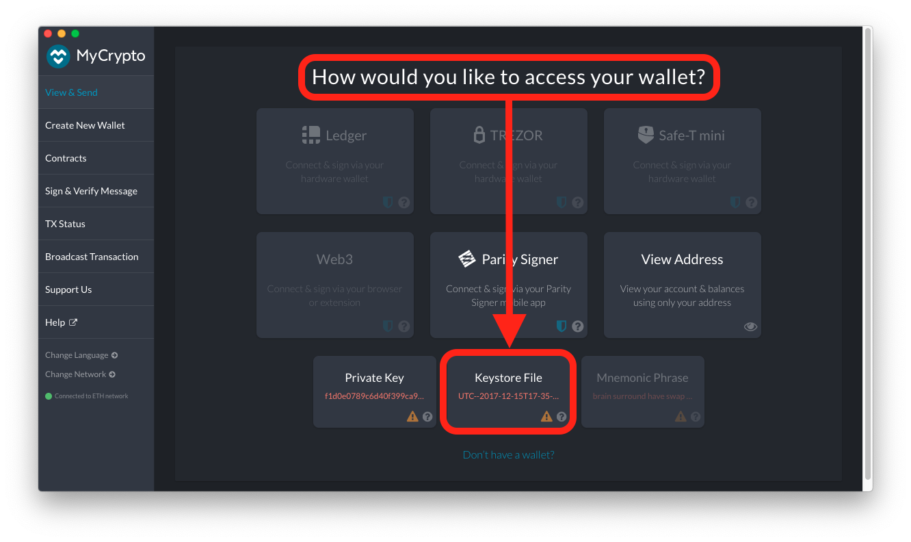
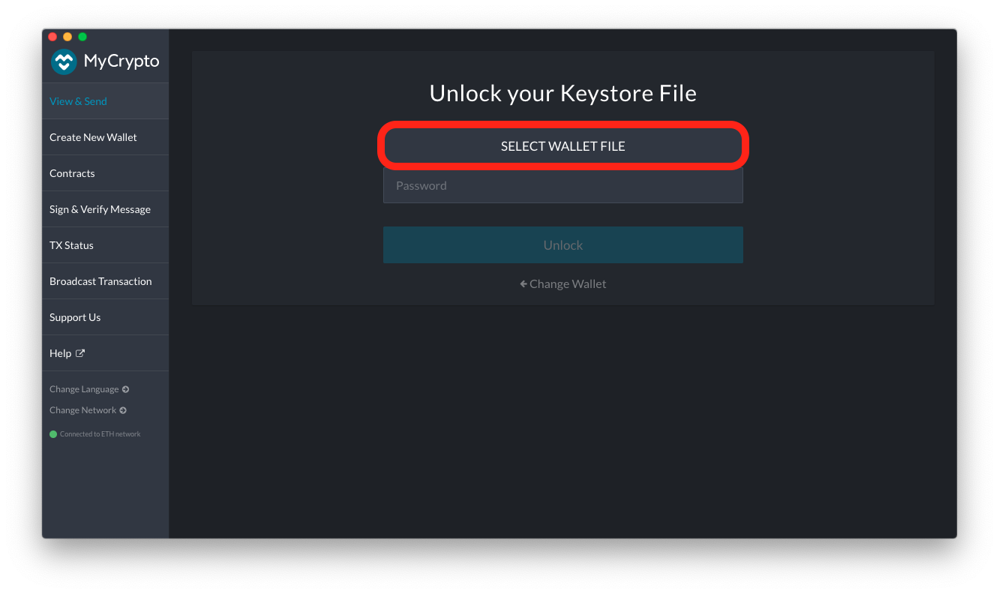
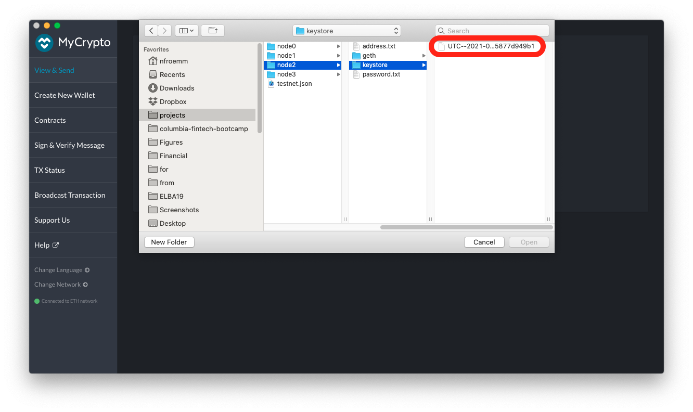
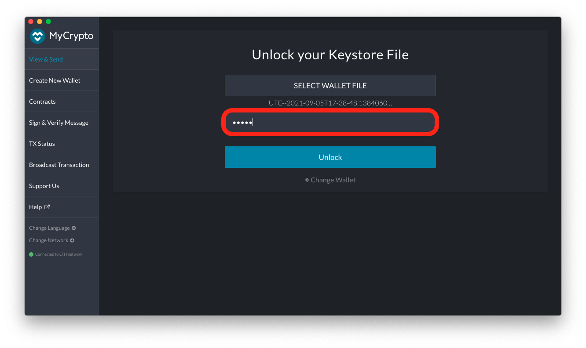
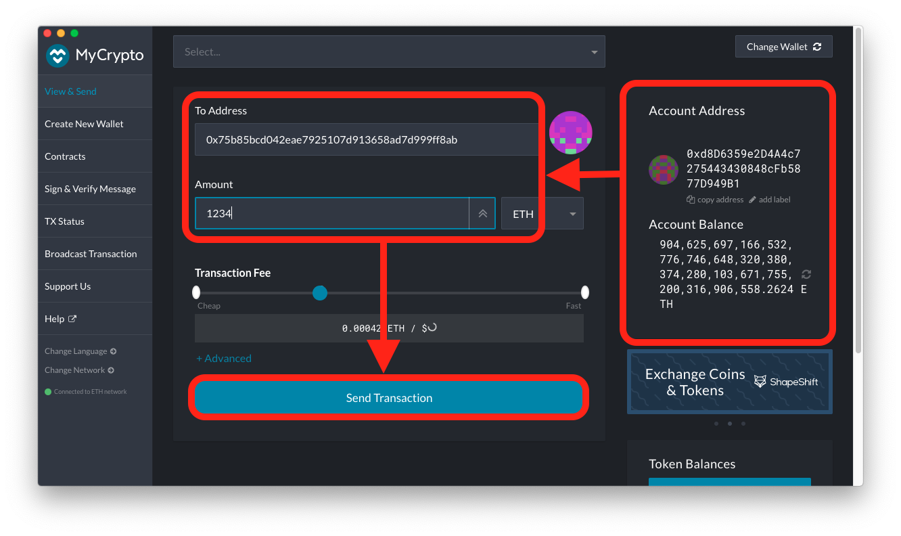
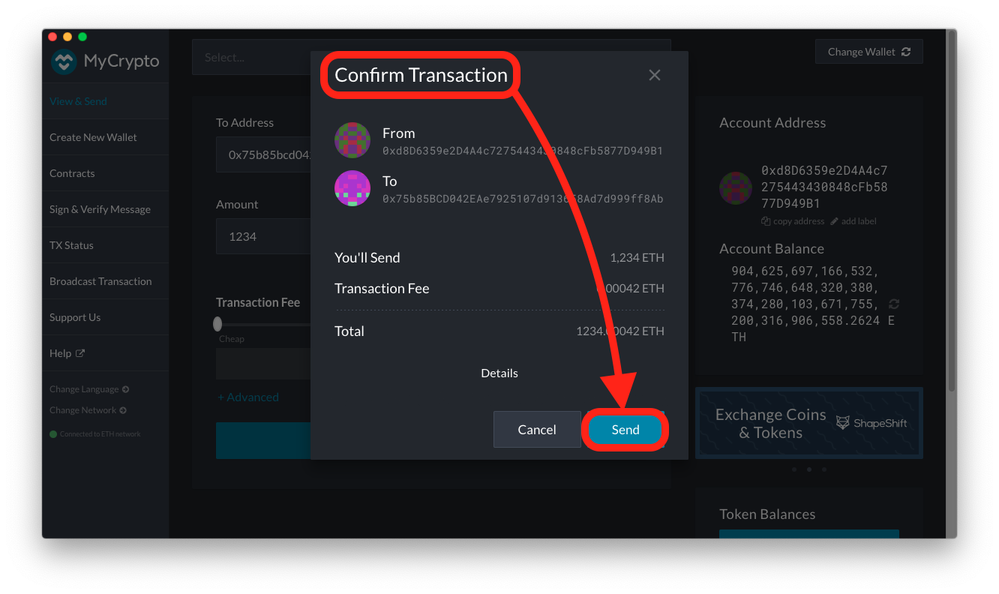
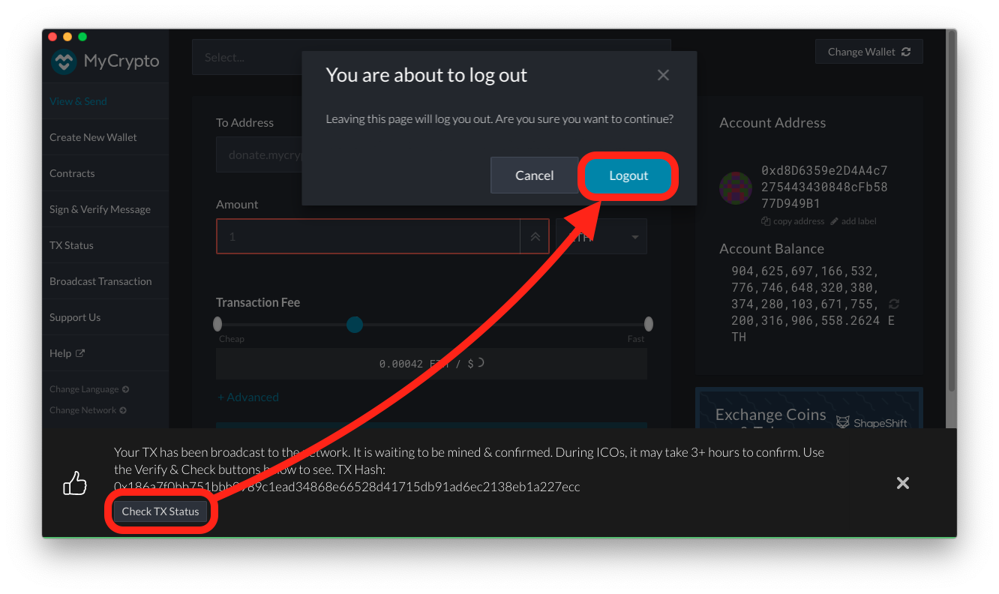
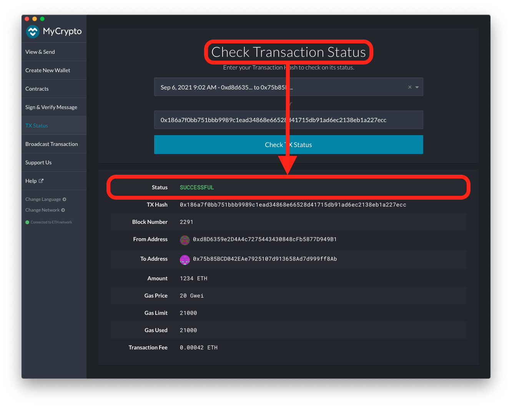
<br>

Here is the GIF again which summarizes the above steps:

<br>

<br>

Congratulations, you have successfully setup your own private blockchain! :thumbsup: :smile:

---

## Table of Contents  <!-- omit in toc -->

- [1. Quick Start](#1-quick-start)
  - [1.1. Start the Blockchain Network](#11-start-the-blockchain-network)
  - [1.2. Send Transactions on the Blockchain Network](#12-send-transactions-on-the-blockchain-network)
    - [1.2.1. MyCrypto GIF and Screenshots](#121-mycrypto-gif-and-screenshots)
- [2. Introduction](#2-introduction)
  - [2.1. Overview](#21-overview)
  - [2.2. Tools and Technologies Utilized](#22-tools-and-technologies-utilized)
  - [2.3. Installation](#23-installation)
- [3. Blockchain Network Details](#3-blockchain-network-details)
  - [3.1. How To Create Node Accounts](#31-how-to-create-node-accounts)
  - [3.2. How To Create Network Genesis Block Using Puppeth](#32-how-to-create-network-genesis-block-using-puppeth)
  - [3.3. How To Initialize Blockchain Nodes](#33-how-to-initialize-blockchain-nodes)
  - [3.4. How To Start Blockchain Network](#34-how-to-start-blockchain-network)
    - [3.4.1. How To Automatically Get The Full Bootnode Address](#341-how-to-automatically-get-the-full-bootnode-address)
    - [3.4.2. Summary of Important Terminal and Helper-Script Outputs](#342-summary-of-important-terminal-and-helper-script-outputs)
  - [3.5. How To Send Transactions On The Blockchain](#35-how-to-send-transactions-on-the-blockchain)
    - [3.5.1. How To Get The Blockchain ID](#351-how-to-get-the-blockchain-id)
    - [3.5.2. MyCrypto Directions](#352-mycrypto-directions)
  - [3.6. Notes, Tips, and Tricks](#36-notes-tips-and-tricks)
    - [3.6.1. Make bash scripts executable](#361-make-bash-scripts-executable)
    - [3.6.2. Geth command-line options](#362-geth-command-line-options)
    - [3.6.3. Explicit commands for launching blockchain nodes from the command line](#363-explicit-commands-for-launching-blockchain-nodes-from-the-command-line)
    - [3.6.4. Default Ethereum data-directory locations on different operating systems](#364-default-ethereum-data-directory-locations-on-different-operating-systems)

---

## 2. Introduction

Developers should know how to create blockchain test networks ("testnets")! :thumbsup: :smile:  Here, we setup a local Proof-of-Authority (PoA) blockchain testnet that will enable us to rapidly develop software, smart contracts, decentralized apps ("dapps"), etc., ***before*** we deploy the software/product to the main Ethereum network ("mainnet")!  Importantly, no real ETH is involved, however, we still get to explore the mechanics of sending test ETH between accounts, etc., as shown in the above screenshots and GIF.

### 2.1. Overview

Here is an overview of how we create our own Proof-of-Authority (PoA) local blockchain testnet in this repository:

1. Create node accounts (`geth`)
2. Configure the network and create genesis block (`puppeth`)
3. Initialize nodes with genesis block (`geth`)
4. Run blockchain (`geth`)
5. Send transactions (`MyCrypto`)

### 2.2. Tools and Technologies Utilized

- [Proof-of-Authority](https://www.insidecryptocoins.com/what-is-proof-of-authority-poa/) local blockchain test network ("testnet")
- [Go-Ethereum](https://geth.ethereum.org/) command-line tools
  - `geth`: Go-Ethereum command line interface
  - `puppeth`: Tool for assembling and maintaining private Ethereum networks
  - `bootnode`: Tool for extracting the full network address of the running bootnode (`node0` in this network)
- [MyCrypto Desktop App](https://download.mycrypto.com/): Ethereum wallet manager

### 2.3. Installation

The MyCrypto Desktop App can be downloaded and installed by following the directions [here](https://download.mycrypto.com/).  Installation of the Go-Ethereum command-line tools on Linux, Mac, and Windows is discussed at length [here](https://geth.ethereum.org/docs/install-and-build/installing-geth).  On a Mac, for example, the go-ethereum command line tools can be installed via the [homebrew](https://brew.sh/) package manager by running the following commands from a Terminal session:

```bash
# Example: Install Go-Ethereum (`geth`) software tools on MacOS (10.15.7) using `homebrew`
brew tap ethereum/ethereum
brew install ethereum  # installs `geth`, `puppeth`, etc.
geth --help  # if you don't see something here, something is wrong!
puppeth --help  # if you don't see something here, something is wrong!
bootnode --help  # if you don't see something here, something is wrong!
```

---

## 3. Blockchain Network Details

### 3.1. How To Create Node Accounts

A helper script, [create_network.sh](create_network.sh), was written to facilitate the creation of new blockchain networks and node accounts from scratch.  Specifically ,the blockchain testnet in this GitHub repository was created by running the command "`create_network.sh testnet 4`," which created a blockchain network named "testnet" with 4 blockchain nodes, as shown below.  

```bash
# Create a new blockchain network named "testnet" with 4 nodes
~/blockchain-testnet$ create_network.sh testnet 4
~/blockchain-testnet$ tree testnet
./testnet
├── node0
│   ├── address.txt
│   ├── keystore
│   │   └── UTC--2021-09-05T17-38-45.541012000Z--75b85bcd042eae7925107d913658ad7d999ff8ab
│   └── password.txt
├── node1
│   ├── address.txt
│   ├── keystore
│   │   └── UTC--2021-09-05T17-38-46.847032000Z--deef199bfcf8577e97c7f224e62fb1f10a5394a3
│   └── password.txt
├── node2
│   ├── address.txt
│   ├── keystore
│   │   └── UTC--2021-09-05T17-38-48.138406000Z--d8d6359e2d4a4c7275443430848cfb5877d949b1
│   └── password.txt
└── node3
    ├── address.txt
    ├── keystore
    │   └── UTC--2021-09-05T17-38-49.416203000Z--919ab4ccf6d44374534061d76223104035210169
    └── password.txt

8 directories, 12 files
~/blockchain-testnet$
```

The first command-line argument to the script [create_network.sh](create_network.sh) is the network name ("testnet," in this case), while the second argument is the number of nodes in the blockchain network.  The number of nodes must be in the range `[2..10]` since (a) it takes at least two nodes to define a network and (b) we would like to keep the network small and lightweight for development/testing purposes.  Under the hood, [create_network.sh](create_network.sh) uses the command `geth account new <...>` to create new blockchain node accounts with dedicated data directories and password files, as shown below.  The account address of each node is saved to the file `node*/address.txt` for easy reference and future use in other scripts below.  Similarly, the password of each node is saved to the file `node*/password.txt`.

```bash
# Create a new node account with a dedicated data directory and password file
geth account new --datadir "$node_dir" --password "$node_password_file"
```

### 3.2. How To Create Network Genesis Block Using Puppeth

In the previous section, we setup the basic infrastructure of our blockchain test network.  This involved creating new node accounts, setting up node data directories, keeping track of node account addresses and passwords, etc.  In this section, we configure the network's *genesis block* using a commande-line tool called "Puppeth."  Puppeth is an Ethereum network manager that lets you manage network genesis blocks, bootnodes, miner nodes, etc.  The exact `puppeth` commands and settings used to create this blockchain test network are shown in the screenshot below.  Here are some important points of the network configuration:

- The `Clique Proof-of-Authority (PoA)` consensus algorithm was chosen instead of proof-of-work (PoW) so that transactions may be validated quickly by "sealer nodes" in the network.  All nodes are sealer nodes in this network, i.e. all nodes can approve transactions.

- All nodes were pre-funded, so that transactions may be sent immediately between nodes.  The node account numbers were taken from `./testnet/node*/account.txt`, which were created when the command `create_network.sh testnet 4` was run.

- The genesis configuration is exported to the file `testnet.json`.  Other files created by Puppeth in this step (e.g. `testnet-harmony.json`) are not used and may be deleted.

The screenshot below shows the exact Puppeth configuration of this network.

<br>
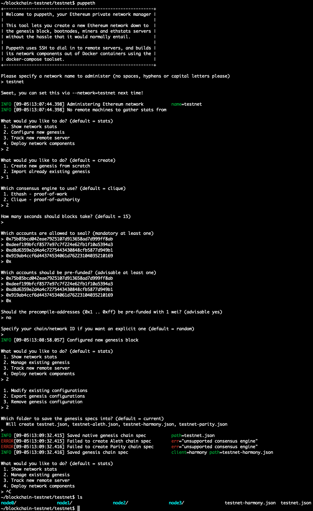
<br>
<br>

### 3.3. How To Initialize Blockchain Nodes

Armed with a genesis configuration created by `puppeth` in the previous section, we can now initialize nodes in the blockchain network.  This is very easy to do using the go-ethereum command line interface, `geth`, as shown below.

```bash
# Use the genesis/network configuration file created with puppeth to initialize
# nodes in the blockchain network
~/blockchain-testnet/testnet$  geth init ./testnet.json --datadir ./node0
~/blockchain-testnet/testnet$  geth init ./testnet.json --datadir ./node1
~/blockchain-testnet/testnet$  geth init ./testnet.json --datadir ./node2
~/blockchain-testnet/testnet$  geth init ./testnet.json --datadir ./node3
```

### 3.4. How To Start Blockchain Network

The easiest way to start the blockchain network is to use the helper script provided, `run_node.sh`, to launch a few blockchain nodes like shown below.

```bash
# How to start the blockchain network
~/blockchain-testnet$  ./run_node.sh 0  # launch `node0` -- do this first!
~/blockchain-testnet$  ./run_node.sh 1  # launch `node1` -- in a different terminal window
~/blockchain-testnet$  ./run_node.sh 2  # launch `node2` -- in a different terminal window
~/blockchain-testnet$  ./run_node.sh 3  # launch `node3` -- in a different terminal window
```

If you are having trouble running the commands above, you have two options: (1) make the script executable first by typing `chmod u+x <script-name>.sh`, then running the above commands; or (2) using `bash run_node.sh 0` instead.  The first argument to `run_node.sh` is the node number.  It is important that the command `run_node.sh 0` be executed first, since `node0` is the bootnode of the network.  The results of running the command `run_node.sh 0` are shown in the screenshot below.  The general parameters used to start the node are printed in plain English for the user's convenience near the top of the script output.  Next, the full `geth` command used to launch the node is printed, also for the user's convenience.  Finally, the full `geth` command is run, and the terminal output of the running process is shown below.

<br>

<br>
<br>

Importantly, the full network address of the bootnode is highlighted in red in the above screenshot -- the bootnode address will be used later when other nodes in the network are launched.  An easy way to get the full bootnode address is to simply copy and paste the line highlighted in red.  Another way to get the full bootnode address is to used the provided script `get_bootnode_address.sh`, which is discussed in the following subsection.

#### 3.4.1. How To Automatically Get The Full Bootnode Address

The line highlighted in red in the above screenshot is the full network address of the bootnode (`node0`).  Although it is possible for users to simply copy the bootnode address when the network is launched, this approach does not work if the full network address of the running bootnode is needed in other shell scripts, for example.  The script `get_bootnode_address.sh` was written to help users extract the full bootnode address using the network default parameters, as shown in the screenshot below.

<br>
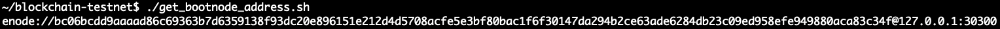
<br>
<br>

Notice that the output above matches the line highlighted in red in the screenshot above.  The key idea behind the script `get_bootnode_address.sh` is to use the ethereum-tools `bootnode` command to get the address of the bootnode `node0`, then to use network parameters to build up the full network address of the bootnode, as shown in the code snippet below.  

```bash
# Construct the full network address of the bootnode (`node0`)
$ NODEKEY=$( bootnode -nodekeyhex $(cat ./testnet/node0/geth/nodekey) -writeaddress )
$ HTTP_ADDRESS="127.0.0.1"
$ PORT="30300"
$ ENODE_ADDRESS="enode://$NODEKEY@$HTTP_ADDRESS:$PORT"
$ echo "$ENODE_ADDRESS"
enode://bc06bcdd9aaaad86c69363b7d6359138f93dc20e896151e212d4d5708acfe5e3bf80bac1f6f30147da294b2ce63ade6284db23c09ed958efe949880aca83c34f@127.0.0.1:30300
```

The default http address of the network is "127.0.0.1" and the default port is `3030X`, where `X` is the node number (`0` for the bootnode, `node0`).  Other nodes in the network are launched via the command `run_node.sh X` and the bootnode address is automatically recalculated.  

#### 3.4.2. Summary of Important Terminal and Helper-Script Outputs

Example outputs of important shell commands are gathered below for the reader's convenience.

<details>
  <summary>Output of bash script `run_node.sh 0`</summary><br>
  <br><br>
</details>

<details>
  <summary>Output of bash script `run_node.sh 1`</summary><br>
  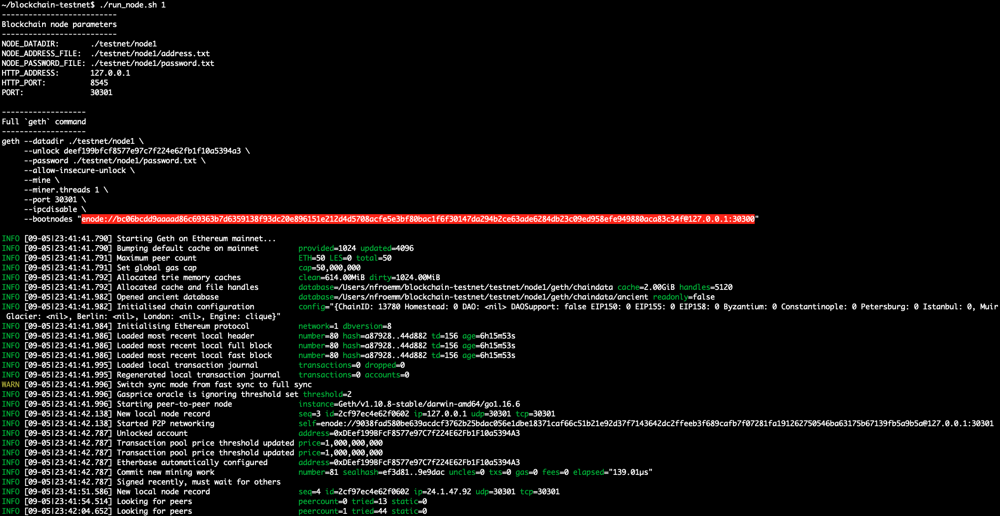<br><br>
</details>

<details>
  <summary>Output of bash script `run_node.sh 2`</summary><br>
  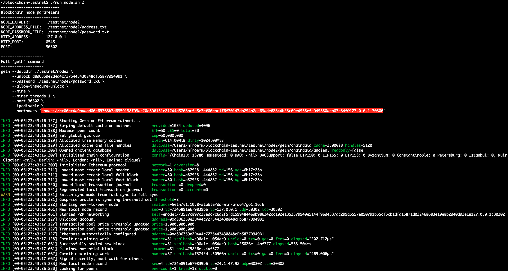<br><br>
</details>

<details>
  <summary>Output of bash script `run_node.sh 3`</summary><br>
  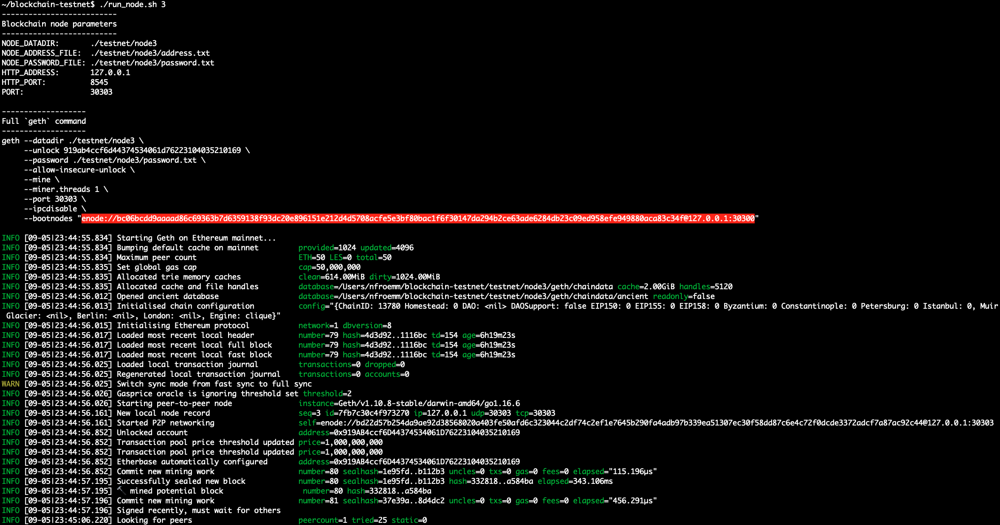<br><br>
</details>

<details>
  <summary>Full running blockchain network</summary><br>
  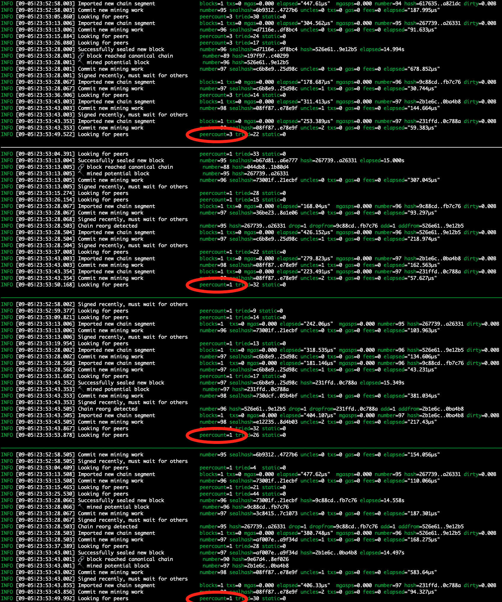<br><br>
</details>
<br>

---

### 3.5. How To Send Transactions On The Blockchain

#### 3.5.1. How To Get The Blockchain ID

Before sending and receiving transactions, it will be helpful to verify the blockchain ID.  You will need this number when connecting MyCrypto to the blockchain network below.  In our case, the blockchain ID of our testnet was chosen randomly by `puppeth` when creating the network genesis (see above).  Here's how to get the blockchain ID from the command line:

```bash
# Get the blockchain ID from file `testnet.json`
$ cat ./testnet.json 
{
  "config": {
    "chainId": 13780,  # this is the blockchain network ID (randomly chosen by `puppeth`)
    "homesteadBlock": 0,
    "eip150Block": 0,
    "eip150Hash": "0x0000000000000000000000000000000000000000000000000000000000000000",
    "eip155Block": 0,
    "eip158Block": 0,
    "byzantiumBlock": 0,
    "constantinopleBlock": 0,
    ...
}
```

#### 3.5.2. MyCrypto Directions

See [Quick Start](#quick-start) above!  Watch the GIF, then follow along with the screenshots provided.

---

### 3.6. Notes, Tips, and Tricks

#### 3.6.1. Make bash scripts executable

If you're having trouble running bash scripts from the command line, it might be because the scripts are not executable.  You have two options:

```bash
# Option 1: Explicitly envoke bash to run the shell script, for example:
$ bash ./create_network.sh testnet 4
$ bash ./get_bootnode_address.sh
$ bash ./run_node.sh 0
...

# Option 2: Make the scripts executable, then run the scripts
Ensure bash scripts are executable
$ chmod u+x create_network.sh
$ chmod u+x get_bootnode_address.sh
$ chmod u+x run_node.sh
# Now that the scripts are executable, run the scripts
$ ./create_network.sh testnet 4
$ ./get_bootnode_address.sh
$ ./run_node.sh 0
...
```

#### 3.6.2. Geth command-line options

The Ethereum ecosystem is ever-evolving!  As a result, the user should always be consulting the documentation.  The `geth` documentation is [here](https://geth.ethereum.org/docs/interface/command-line-options).  Note that you can always `geth --help` from the command line.  The code snippet below shows the results of running `geth --help`.  Note that the flag `--rpc` is deprecated in favor of `--http` for example.

```bash
# Example `geth --help` output.  Note the deprecated flags.
ALIASED (deprecated) OPTIONS:
  --nousb                             Disables monitoring for and managing USB hardware wallets (deprecated)
  --rpc                               Enable the HTTP-RPC server (deprecated and will be removed June 2021, use --http)
  --rpcaddr value                     HTTP-RPC server listening interface (deprecated and will be removed June 2021, use --http.addr) (default: "localhost")
  --rpcport value                     HTTP-RPC server listening port (deprecated and will be removed June 2021, use --http.port) (default: 8545)
  --rpccorsdomain value               Comma separated list of domains from which to accept cross origin requests (browser enforced) (deprecated and will be removed June 2021, use --http.corsdomain)
  --rpcvhosts value                   Comma separated list of virtual hostnames from which to accept requests (server enforced). Accepts '*' wildcard. (deprecated and will be removed June 2021, use --http.vhosts) (default: "localhost")
  --rpcapi value                      API's offered over the HTTP-RPC interface (deprecated and will be removed June 2021, use --http.api)
  --miner.gastarget value             Target gas floor for mined blocks (deprecated) (default: 0)
```

#### 3.6.3. Explicit commands for launching blockchain nodes from the command line

The core commands run by the script `run_node.sh` are essentially the following:

```bash
# Launch the bootnode, i.e. `node0`, from the command line
$ geth --datadir ./testnet/node0 \
       --unlock $(cat ./testnet/node0/address.txt) \
       --password ./testnet/node0/password.txt \
       --allow-insecure-unlock \
       --http \
       --http.addr "127.0.0.1" \
       --http.port 8545
       --port 30300 \
       --mine \
       --miner.threads 1

# Launch other nodes from the command line, e.g. `node1`
$ geth --datadir ./testnet/node1 \
       --unlock $(cat ./testnet/node1/address.txt) \
       --password ./testnet/node1/password.txt \
       --allow-insecure-unlock \
       --bootnodes "enode://bc06bcdd9aaaad86c69363b7d6359138f93dc20e896151e212d4d5708acfe5e3bf80bac1f6f30147da294b2ce63ade6284db23c09ed958efe949880aca83c34f@127.0.0.1:30300" \
       --ipcdisable \
       --port 30301 \
       --mine \
       --miner.threads 1 \
```

#### 3.6.4. Default Ethereum data-directory locations on different operating systems

| Operating System | Default Ethereum Data Directory |
| :--------------- | :------------------------------ |
| Windows          | `%APPDATA%\Ethereum`|
| Mac              | `~/Library/Ethereum`|
| Linux            | `~/.ethereum`|

---
