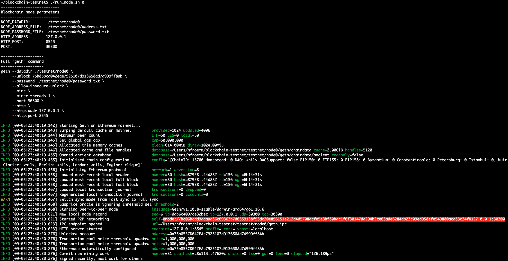

<!--
# TODO

- [ ] Rename `create_network.sh` to `create_network_accounts.sh`?
- [ ] Some of the `geth` command-line options that were used in class are deprecated.  For example, `--rpc` should be replaced by `--http`, etc.  Please see the output near the bottom of `geth --help` for more deprecated command-line options.

-->

# Blockchain Testnet  <!-- omit in toc -->

<br>
*Image Credit (Above): [LuckyStep48](https://www.shutterstock.com/g/LuckyStep48)*

---

## Quick Start  <!-- omit in toc -->

### Launch the Blockchain Network

A blockchain network is comprised of a collection of computer nodes that can communicate with one another.  The GIF below shows how to launch 4 custom blockchain nodes using the helper script `run_node.sh`.  These nodes form the blockchain test network ("testnet").  Details of the network creation and settings are discussed in the sections below.

<br>

### Send Transactions on the Blockchain Network

After the blockchain network has been started (see above), transactions may be sent between any nodes in the network.  The GIF below shows an example of `node2` sending `1234 ETH` to `node1` using [MyCrypto](https://www.mycrypto.com/).  Details are discussed in the sections below.

<br>

---

## Table of Contents  <!-- omit in toc -->

- [Introduction](#introduction)
- [Tools and Technologies Utilized](#tools-and-technologies-utilized)
- [Important Files](#important-files)
- [Blockchain Network Details](#blockchain-network-details)
  - [Create Node Accounts](#create-node-accounts)
  - [Create Network Genesis Block](#create-network-genesis-block)
  - [Initialize Blockchain Nodes](#initialize-blockchain-nodes)
  - [Start Blockchain Network](#start-blockchain-network)
    - [How to automatically get the full bootnode address](#how-to-automatically-get-the-full-bootnode-address)
  - [Summary of Important Terminal and Helper-Script Outputs](#summary-of-important-terminal-and-helper-script-outputs)
- [Sending and Receiving Transactions](#sending-and-receiving-transactions)
  - [How To Get The Blockchain ID](#how-to-get-the-blockchain-id)
  - [MyCrypto Screenshots and GIF](#mycrypto-screenshots-and-gif)
    - [MyCrypto Screenshots](#mycrypto-screenshots)
    - [MyCrypto GIF](#mycrypto-gif)
  - [Tips and Tricks](#tips-and-tricks)

---

## Introduction

Developers should know how to create blockchain test networks ("testnets")! :thumbsup: :smile:  Here is an overview of the process:

1. Create node accounts (`geth`)
2. Configure the network and create genesis block (`puppeth`)
3. Initialize nodes with genesis block (`geth`)
4. Run blockchain (`geth`)
5. Send transactions (`MyCrypto`)

---

## Tools and Technologies Utilized

- Proof-of-Authority blockchain network
- [Go-Ethereum](https://geth.ethereum.org/)
  - `geth`
  - `puppeth`
  - `bootnode`
- [MyCrypto Desktop App](https://download.mycrypto.com/): Ethereum wallet manager

---

## Important Files

---

## Blockchain Network Details

### Create Node Accounts

A helper script, [create_network.sh](create_network.sh), was written to facilitate the creation of new blockchain networks from scratch.  The blockchain testnet in this GitHub repository was created by running the command "`create_network.sh testnet 4`," which creates a blockchain network named "testnet" with 4 blockchain nodes, as shown below.  

```bash
# Create a new blockchain network named "testnet" with 4 nodes
~/blockchain-testnet$ create_network.sh testnet 4
~/blockchain-testnet$ tree testnet
./testnet
├── node0
│   ├── address.txt
│   ├── keystore
│   │   └── UTC--2021-09-05T17-38-45.541012000Z--75b85bcd042eae7925107d913658ad7d999ff8ab
│   └── password.txt
├── node1
│   ├── address.txt
│   ├── keystore
│   │   └── UTC--2021-09-05T17-38-46.847032000Z--deef199bfcf8577e97c7f224e62fb1f10a5394a3
│   └── password.txt
├── node2
│   ├── address.txt
│   ├── keystore
│   │   └── UTC--2021-09-05T17-38-48.138406000Z--d8d6359e2d4a4c7275443430848cfb5877d949b1
│   └── password.txt
└── node3
    ├── address.txt
    ├── keystore
    │   └── UTC--2021-09-05T17-38-49.416203000Z--919ab4ccf6d44374534061d76223104035210169
    └── password.txt

8 directories, 12 files
~/blockchain-testnet$
```

The first command-line argument to the script [create_network.sh](create_network.sh) is the network name ("testnet," in this case), while the second argument is the number of nodes in the blockchain network.  The number of nodes must be in the range `[2..10]` since (a) it takes at least two nodes to define a network and (b) we would like to keep the network small and lightweight for development and testing purposes.  Under the hood, [create_network.sh](create_network.sh) uses the command `geth account new <...>` to create new blockchain node accounts with dedicated data directories and password files, as shown below.  Additionally, the account address of each node is saved to the file `node*/address.txt` for easy reference and future use in other scripts below.

```bash
# Create a new node account with a dedicated data directory and password file
geth account new --datadir "$node_dir" --password "$node_password_file"
```

### Create Network Genesis Block

In the previous section, we setup the basic infrastructure of our blockchain test network.  In this section, we will configure the network's *genesis block* using Puppeth.  Puppeth is an Ethereum network manager that lets you manage network genesis blocks, bootnodes, miners, etc.  The exact `puppeth` commands and settings used to create this blockchain test network are shown in the screenshot below.  Here are some important points of the network configuration:

- The `Clique (Proof of Authority)` consensus algorithm is chosen instead of proof-of-work so that transactions may quickly be validated by nodes in the network instead of wasting time and computational resources mining transactions.
- The node account numbers from the prvious section are used as sealer addresses as well as accounts to prefund with test ETH.  Remember, node account numbers are available in the files `testnet/node*/account.txt`.
- The genesis configuration is exported to the file `testnet.json`.  Other files created by Puppeth in this step (e.g. `testnet-harmony.json`) are not used and may be deleted.

<br>

<br>
<br>

### Initialize Blockchain Nodes

Armed with a genesis configuration created by `puppeth` in the previous section, we can now initialize nodes in the blockchain network.  This is very easy using the go-ethereum command line interface, `geth`:

```bash
# Use the genesis/network configuration file from the previous step to initialize
# nodes in the network
~/blockchain-testnet/testnet$  geth init ./testnet.json --datadir ./node0
~/blockchain-testnet/testnet$  geth init ./testnet.json --datadir ./node1
~/blockchain-testnet/testnet$  geth init ./testnet.json --datadir ./node2
~/blockchain-testnet/testnet$  geth init ./testnet.json --datadir ./node3
```

### Start Blockchain Network

The easiest way to start the blockchain network is to use the helper script provided, `run_node.sh`, to launch a few blockchain nodes like shown below.

```bash
# How to start the blockchain network
~/blockchain-testnet$  ./run_node.sh 0  # launch `node0` -- do this first
~/blockchain-testnet$  ./run_node.sh 1  # launch `node1` -- in a different terminal window
~/blockchain-testnet$  ./run_node.sh 2  # launch `node2` -- in a different terminal window
~/blockchain-testnet$  ./run_node.sh 3  # launch `node3` -- in a different terminal window
```

The first argument to `run_node.sh` is the node number.  It is important that the command `run_node.sh 0` be executed first, since `node0` is the bootnode of the network.  The results of running the command `run_node.sh 0` are shown in the screenshot below.  The general parameters used to start the node are printed in plain English for the user's convenience near the top of the script output.  The full `geth` command used to launch the node is printed below the plain-English parameters.  The terminal output from running the full `geth` command is shown toward the bottom of the screenshot.  Importantly, the full address of the bootnode is highlighted in red -- the bootnode address will be used below when we launch the other nodes in the network.  An easy way to get the full bootnode address is to simply copy and paste the line highlighted in red.  Another way to get the full bootnode address is to used the provided script `get_bootnode_address.sh`, which is discussed in the following subsection.

<br><br><br>

#### How to automatically get the full bootnode address

The line highlighted in red in the above screenshot is the full address of the network bootnode (`node0`).  An easy way to get the full bootnode address is to simply copy the red line above when the newtork is launched, but what if we'd like to extract the bootnode address automatically for use in other scripts, for example.  The helper script `get_bootnode_address.sh` was written to help user's easily extract the full bootnode address using the network default parameters as shown below.

<br><br><br>

Notice that the output above matches the line highlighted in red in the screenshot above.  The key idea behind `get_bootnode_address.sh` is to use the ethereum-tools `bootnode` command to get the address of the bootnode `node0`, then to use network parameters to build up the full network address of the bootnode, as shown below.  The default http address is "127.0.0.1" and the default port is `3030X`, where `X` is the node number (`0` for the bootnode, `node0`).  

```bash
# Construct the full network address of the bootnode (`node0`)
$ NODEKEY=$( bootnode -nodekeyhex $(cat ./testnet/node0/geth/nodekey) -writeaddress )
$ HTTP_ADDRESS="127.0.0.1"
$ PORT="30300"
$ ENODE_ADDRESS="enode://$NODEKEY@$HTTP_ADDRESS:$PORT"
$ echo "$ENODE_ADDRESS"
enode://bc06bcdd9aaaad86c69363b7d6359138f93dc20e896151e212d4d5708acfe5e3bf80bac1f6f30147da294b2ce63ade6284db23c09ed958efe949880aca83c34f@127.0.0.1:30300
```

Other nodes in the network are launched via the command `run_node.sh X` and the bootnode address is automatically recalculated.  Example outputs are gathered below for the reader's convenience.

### Summary of Important Terminal and Helper-Script Outputs

<details>
  <summary>Output of bash script `run_node.sh 0`</summary><br>
  <br><br>
</details>

<details>
  <summary>Output of bash script `run_node.sh 1`</summary><br>
  <br><br>
</details>

<details>
  <summary>Output of bash script `run_node.sh 2`</summary><br>
  <br><br>
</details>

<details>
  <summary>Output of bash script `run_node.sh 3`</summary><br>
  <br><br>
</details>

<details>
  <summary>Full running blockchain network</summary><br>
  <br><br>
</details>
<br>

---

## Sending and Receiving Transactions

### How To Get The Blockchain ID

Before sending and receiving transactions, it will be helpful to verify the blockchain ID.  You will need this number when connecting MyCrypto to the blockchain network below.  In our case, the blockchain ID of our testnet was chosen randomly by `puppeth` when creating the network genesis (see above).  Here's how to get the blockchain ID from the command line:

```bash
# Get the blockchain ID from file `testnet.json`
$ cat ./testnet.json 
{
  "config": {
    "chainId": 13780,  # this is the blockchain network ID (randomly chosen by `puppeth`)
    "homesteadBlock": 0,
    "eip150Block": 0,
    "eip150Hash": "0x0000000000000000000000000000000000000000000000000000000000000000",
    "eip155Block": 0,
    "eip158Block": 0,
    "byzantiumBlock": 0,
    "constantinopleBlock": 0,
    ...
}
```

### MyCrypto Screenshots and GIF

#### MyCrypto Screenshots


   


#### MyCrypto GIF

<br>

<br>
<br>

Congratulations, you successfully created your own private blockchain! :thumbsup: :smile:

---

### Tips and Tricks

```bash
# Always be mindful of deprecated command-line options!  Type `geth --help` for more details.
ALIASED (deprecated) OPTIONS:
  --nousb                             Disables monitoring for and managing USB hardware wallets (deprecated)
  --rpc                               Enable the HTTP-RPC server (deprecated and will be removed June 2021, use --http)
  --rpcaddr value                     HTTP-RPC server listening interface (deprecated and will be removed June 2021, use --http.addr) (default: "localhost")
  --rpcport value                     HTTP-RPC server listening port (deprecated and will be removed June 2021, use --http.port) (default: 8545)
  --rpccorsdomain value               Comma separated list of domains from which to accept cross origin requests (browser enforced) (deprecated and will be removed June 2021, use --http.corsdomain)
  --rpcvhosts value                   Comma separated list of virtual hostnames from which to accept requests (server enforced). Accepts '*' wildcard. (deprecated and will be removed June 2021, use --http.vhosts) (default: "localhost")
  --rpcapi value                      API's offered over the HTTP-RPC interface (deprecated and will be removed June 2021, use --http.api)
  --miner.gastarget value             Target gas floor for mined blocks (deprecated) (default: 0)
```

---
